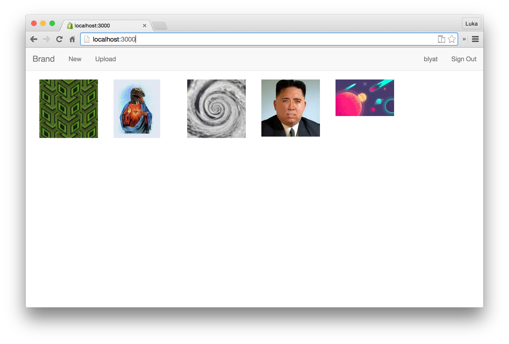

Imgupl  
======

Fancy image upload platform.

## Features

* [x] Upload images (duh)
* [x] Comment uploads
* [ ] Rate uploads/comments
* [ ] Tag uploads
* [x] Role system (guest, user, mod, admin)

## Configuration

The app is configured with the following environment variables.

| variable                   | description              | default        | required |
|----------------------------|--------------------------|----------------|:--------:|
| `HOST`                     | Host to link to          | localhost:3000 |          |
| `DATABASE_CONNECTION_POOL` | Postgres connection pool | 5              |          |
| `DATABASE_DB`              | Posgres database name    |                | ✓        |
| `DATABASE_HOST`            | Postgres host            | localhost      |          |
| `DATABASE_PASSWORD`        | Postgress password       |                |          |
| `DATABASE_PORT`            | Postgres port            | 5432           |          |
| `DATABASE_USERNAME`        | Postgres username        | current user   |          |
| `PORT`                     | Port to listen on        | 3000           |          |
| `PUMA_THREADS`             | Number of puma threads   | 5              |          |
| `S3_BUCKET`                | AWS S3 Bucket            |                | ✓        |
| `S3_KEY`                   | AWS S3 KEY               |                | ✓        |
| `S3_REGION`                | AWS S3 REGION            |                | ✓        |
| `S3_SECRET`                | AWS S3 SECRET            |                | ✓        |
| `S3_ENDPOINT`              | AWS S3 ENDPOINT          |                | ✓        |
| `SECRET_KEY_BASE`          | Secret key base          |                | ✓        |

## Hacking

* Install [docker-compose](http://docs.docker.com/compose/install/)
* Run `docker-compose up` and visit 
* Visit  for the mailcatcher web interface

## Contributing

1. Fork it ( https://github.com/lukad/imgupl/fork )
2. Create your feature branch (`git checkout -b feature/my-new-feature`)
3. Run the tests `bundle exec rspec`
4. Commit your changes (`git commit -am ':boom: add some feature'`)
5. Push to the branch (`git push origin feature/my-new-feature`)
6. Create a new Pull Request
